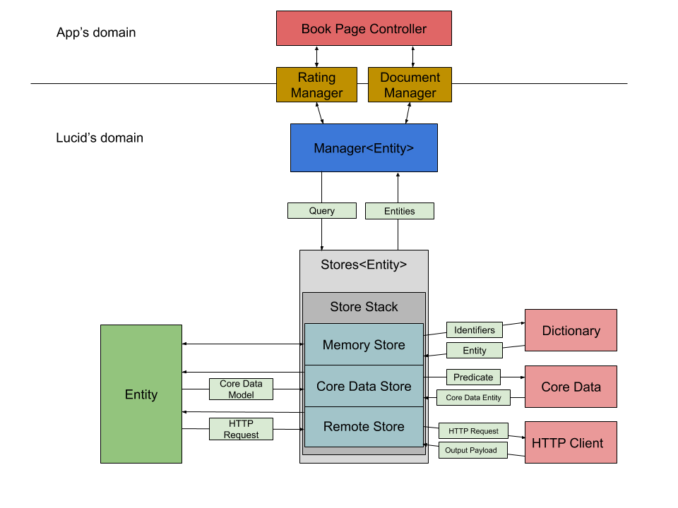

# Lucid - Architecture

Lucid is designed around the idea that a data flow should be derived from its resources, and not the other way around. Therefore, almost every pieces depend on an entity type. An entity is usually a business related object which holds the data required to run the app's business logic. For example, it could be a user, or a [movie](../Sample/Generated/Lucid/Entities/Movie.swift), or anything useful to run a business.

Every entity implements a set of rules telling Lucid how to store them, how to fetch them from a remote, how to build them from a JSON payload, etc... These rules are described in a series of [Swift protocols](../Lucid/Core/Entity.swift).

Since Lucid is about data flows, it needs to be able to read and write data in a variety of formats. These are what the stores are for. A store is an object which can read/write entities from/to a specific location, like a server ([remote store](../Lucid/Stores/RemoteStore.swift)), a database ([core data store](../Lucid/Stores/CoreDataStore.swift)), or a cache ([in memory store](../Lucid/Stores/InMemoryStore.swift)). All stores implement the same [interface](../Lucid/Core/Store.swift) and are therefore easily pluggable and composable.

Every store is meant to handle data coming from/to different places, either local (client-side) or remote (server-side). In order to keep all the stores synchronized and avoid conflicts, they need to be interacted with in a specific way. This is the role of the [manager](../Lucid/Core/CoreManager.swift). A manager is an object derived from an entity type, and which knows how to interact with the stores depending on the use case. They constitute the only exposed bit of interface to the application's domain.

Essentially, a manager can do a combination of operations defined by a method, a [query](../Lucid/Core/Query.swift) and a [context](../Lucid/Core/Context.swift). The method defines the nature of the operation; get/set/remove/search. The query describes how the concerned data should be selected/transformed. The context provides contextual information about the data source or target, the persistence strategy which shall be used, access restrictions, etc...
