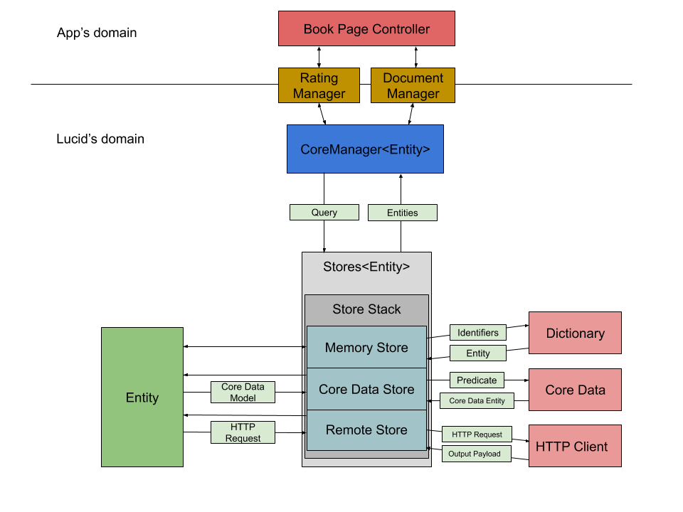

# Lucid - Architecture

### Abstract Concepts

Lucid is designed around the idea that a data flow should be derived from its resources, and not the other way around. Therefore, almost every piece depends on an entity type. An entity is usually a business-related object which holds the data required to run the app's business logic. For example, it could be a user, or a [movie](../Sample/Generated/Lucid/Entities/Movie.swift), or anything useful to run a business.

Each entity implements a set of rules telling Lucid how to store it, how to fetch it from a remote source, how to build it from a JSON payload, etc... These rules are described in a series of [Swift protocols](../Lucid/Core/Entity.swift).

Since Lucid is about data flows, it needs to be able to read and write data in a variety of formats. These are what the stores are for. A store is an object which can read/write entities to/from a specific location, like a server ([remote store](../Lucid/Stores/RemoteStore.swift)), a database ([core data store](../Lucid/Stores/CoreDataStore.swift)), or a cache ([in-memory store](../Lucid/Stores/InMemoryStore.swift)). All stores implement the same [interface](../Lucid/Core/Store.swift) and are therefore easily pluggable and composable.

Every store is meant to handle data coming to/from different places, either local (client-side) or remote (server-side). In order to keep all the stores synchronized and avoid conflicts, they need to be interacted with in a specific way. This is the role of the [manager](../Lucid/Core/CoreManager.swift). A manager is an object derived from an entity type, and which knows how to interact with the stores depending on the use case. They constitute the only exposed bit of interface to the application's domain.

Essentially, a manager performs operations that are composed of a method, a [query](../Lucid/Core/Query.swift) and a [context](../Lucid/Core/Context.swift). The method defines the nature of the operation: get/set/remove/search. The query describes how the concerned data should be selected/transformed. The context provides information about the data source or target, the persistence strategy, and any access restrictions.

### Technical Concepts

Due to the abstract nature of the Lucid structure, there is a lot of supporting code that is needed to make it all work. Rather than require the developer to write it themselves, Lucid comes with a set of pre-compilation commands that generates all of the code you need to put the pieces together.

Among these [commands](../CodeGen/Sources/LucidCommand/main.swift), the most important one is `lucid swift`. From a group of [json files](../Sample/Generated/Lucid) describing your application's entities, payloads and endpoints, it generates the code for the corresponding data objects. Once generated, this code can be compiled with your application and can leverage the abstract concepts and mechanisms of Lucid's runtime framework.

TLDR - Technically, Lucid is composed of two binaries: 

- **[Swift Framework](../Lucid)** which is shipped with the application.
- **[Command Line Tool](../CodeGen)** which generates the Swift code to support Lucid's use in the application.

